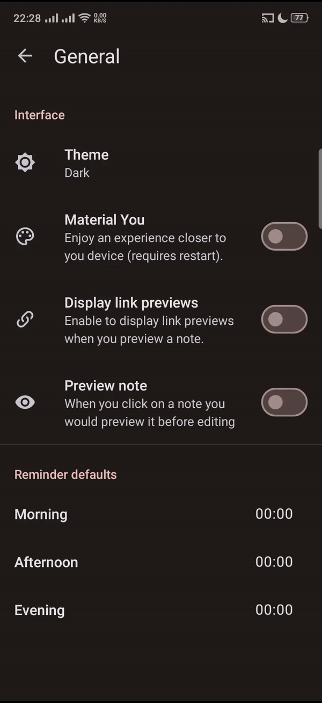

# Material Time Picker Preference

This repository contains a Java code implementation of a Material Time Picker preference. The preference allows users to select a time using a Material Design styled time picker.

## Demo


## Installation

To use this Material Time Picker preference in your Android project, follow these steps:

1. Download the `MaterialTimePickerPreference.java` file from this repository.
2. Follow the instructions and copy the codes into your project's source code directory.
3. Add the following dependency to your project's `build.gradle` file:

```groovy
implementation 'com.google.android.material:material:<version>'
implementation 'androidx.preference:preference:<version>'   
   
```
## Usage

To use the Material Time Picker preference in your Android app, follow these steps:

1. Open the XML layout file where you want to add the preference.
2. Add the following code to the layout file:

```xml
<?xml version="1.0" encoding="utf-8"?>
<LinearLayout
     xmlns:android="http://schemas.android.com/apk/res/android"
     android:layout_height="wrap_content"
     android:layout_width="match_parent"
     android:paddingEnd="16dp"
     android:gravity="center_vertical"
     android:minHeight="?android:listPreferredItemHeightSmall"
     android:orientation="horizontal"
     android:paddingBottom="8dp"
     android:paddingStart="16dp"
     android:paddingTop="8dp">

    <TextView
         android:layout_height="wrap_content"
         android:layout_width="wrap_content"
         android:gravity="center"
         android:textAppearance="?textAppearanceBody1"
         android:ellipsize="marquee"
         android:singleLine="true"
         android:layout_weight="1"
         android:id="@+id/time_stamp" />

</LinearLayout>

```
Replace YourPackage with the package name of your app.

3. Then add the following code in your ``/values/attrs.xml``

```xml
<!-- TimePickerPreference -->
    <declare-styleable name="MaterialTimePickerPreference">
        <attr
            name="presetValue"
            format="string" />
    </declare-styleable>
```
Also add the following in your ``/xml/your_preference.xml``

```xml
 <com.your_package_name.example.MaterialTimePickerPreference
            app:iconSpaceReserved="false"
            android:defaultValue="Morning"
            android:key="your_key" />
```            

4. In the corresponding Java file, add the following code to handle the preference selection:

```java

package com.your_package_name.example;

import android.content.Context;
import android.content.res.TypedArray;
import android.util.AttributeSet;
import android.widget.TextView;
import androidx.appcompat.app.AppCompatActivity;
import androidx.preference.Preference;
import androidx.preference.PreferenceViewHolder;
import com.google.android.material.timepicker.MaterialTimePicker;
import com.google.android.material.timepicker.TimeFormat;
import com.your_package_name.example.R;

public class MaterialTimePickerPreference extends Preference {

  private String timeValue;

  public MaterialTimePickerPreference(Context context) {
    super(context);
  }

  public MaterialTimePickerPreference(Context context, AttributeSet attrs) {
    super(context, attrs);
    init(context, attrs);
  }

  public MaterialTimePickerPreference(Context context, AttributeSet attrs, int defStyle) {
    super(context, attrs, defStyle);
    init(context, attrs);
  }

  private void init(Context context, AttributeSet attrs) {
    setWidgetLayoutResource(R.layout.mtrl_time_picker_time_stamp);
    if (attrs != null) {
      TypedArray a =
          context.getTheme().obtainStyledAttributes(attrs, R.styleable.MaterialTimePickerPreference, 0, 0);
      try {
        timeValue = a.getString(R.styleable.MaterialTimePickerPreference_presetValue);
      } finally {
        a.recycle();
      }
    }
  }

  @Override
  public void onBindViewHolder(PreferenceViewHolder holder) {
    super.onBindViewHolder(holder);
    TextView timeTextView = (TextView) holder.findViewById(R.id.time_stamp);
    timeTextView.setText(timeValue);
  }

  @Override
  protected void onClick() {
    super.onClick();

    MaterialTimePicker timePicker =
        new MaterialTimePicker.Builder().setTimeFormat(TimeFormat.CLOCK_24H).build();

    timePicker.addOnPositiveButtonClickListener(
        v -> {
          int hour = timePicker.getHour();
          int minute = timePicker.getMinute();
          String selectedTime = String.format("%02d:%02d", hour, minute);

          timeValue = selectedTime;
          persistString(selectedTime);

          notifyChanged();
        });

    timePicker.show(((AppCompatActivity) getContext()).getSupportFragmentManager(), "timePicker");
  }

  @Override
  protected Object onGetDefaultValue(TypedArray a, int index) {
    return a.getString(index);
  }

  @Override
  protected void onSetInitialValue(Object defaultValue) {
    timeValue = getPersistedString((String) defaultValue);
    persistString(timeValue);
  }

  public String getTimeValue() {
    return this.timeValue;
  }

  public void setTimeValue(String timeValue) {
    this.timeValue = timeValue;
    persistString(timeValue);
    notifyChanged();
  }
}

```
Replace com.your_package_name.example with the your package name of your project.

5. Build and run your Android app. When the Material Time Picker preference is tapped, the Material Time Picker dialog will be displayed, allowing the user to select a time.

# Contributing
Contributions to this repository are welcome! If you encounter any issues or have suggestions for improvements, feel free to open an issue or submit a pull request.

## License
[](https://opensource.org/licenses/MIT)

MIT License

Copyright © 2023 Etido

Permission is hereby granted, free of charge, to any person obtaining a copy of this software and associated documentation files (the “Software”), to deal in the Software without restriction, including without limitation the rights to use, copy, modify, merge, publish, distribute, sublicense, and/or sell copies of the Software, and to permit persons to whom the Software is furnished to do so, subject to the following conditions:

> The above copyright notice and this permission notice shall be included in all copies or substantial portions of the Software.

THE SOFTWARE IS PROVIDED “AS IS,” WITHOUT WARRANTY OF ANY KIND, EXPRESS OR IMPLIED, INCLUDING BUT NOT LIMITED TO THE WARRANTIES OF MERCHANTABILITY, FITNESS FOR A PARTICULAR PURPOSE, AND NONINFRINGEMENT. IN NO EVENT SHALL THE AUTHORS OR COPYRIGHT HOLDERS BE LIABLE FOR ANY CLAIM, DAMAGES, OR OTHER LIABILITY, WHETHER IN AN ACTION OF CONTRACT, TORT, OR OTHERWISE, ARISING FROM, OUT OF, OR IN CONNECTION WITH THE SOFTWARE OR THE USE OR OTHER DEALINGS IN THE SOFTWARE.
